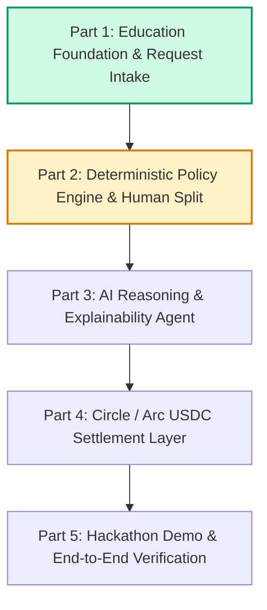

# EduFlow AI — Project Plan & Architecture Roadmap

**Tagline:** An autonomous financial agent for education with bounded execution and programmable USDC payments.

---

## 1. Executive Summary & Core Concept

EduFlow AI is an education finance platform that transforms slow, manual student financial assistance into a bounded, intelligent, and auditable system. 

Traditional education assistance models operate sequentially:
> Student request $\rightarrow$ Manual review $\rightarrow$ Manual approval $\rightarrow$ Slow bank transfer.

EduFlow introduces a **bounded autonomous agent loop**:
> Student request $\rightarrow$ Policy & eligibility evaluation $\rightarrow$ Autonomous approval within strict limits $\rightarrow$ Human escalation for exceptions $\rightarrow$ Programmable USDC disbursement.

### Non-Negotiable Security Principle
The Large Language Model (LLM) **never** has direct access to private keys or direct authorization to move funds. All financial actions are strictly governed by a deterministic policy engine and dual-ledger database state before any blockchain transaction can be dispatched.

---

## 2. Multi-Part Implementation Roadmap

---

### Part 1: Education Data Foundation & Request Intake (COMPLETED)
- [x] **Data Foundation:**
  - `Student` model linked to `User` with student number, program, year level, academic status, and attendance rate.
  - `AcademicTerm` model with calendar boundaries and `isActive()` evaluation.
  - `TuitionAccount` model storing integer base-unit USDC amounts (6 decimal places) with computed remaining balance.
  - `AssistanceRequest` model with UUID `submission_key` idempotency constraints and non-negative database triggers.
  - Database migration `2026_09_26_043655_create_education_tables.php`.
- [x] **Access Control:**
  - Extended `RoleEnums` with `STUDENT` and `FINANCE_OFFICER`.
  - Restricted Filament panels: `/finance` for finance officers/admins, `/admin` for super admins only.
  - Allowlisted user activity logging to prevent credential/secret leakage.
- [x] **Student Interface (React / Inertia 3):**
  - Student dashboard at `/student/dashboard` displaying tuition balance and request history.
  - Assistance request form at `/assistance/create` with decimal USDC validation (up to 1,000,000 max).
  - Assistance detail page at `/assistance/{id}` with clear status tracking.
- [x] **Staff Review Panel (Filament 5):**
  - Dedicated `FinancePanelProvider` at `/finance` with `AssistanceRequestResource`.
  - Read-only table and infolist showing exact 6-decimal USDC values, student academic standing, and tuition accounts.
- [x] **Testing & Validation:**
  - 249 passing Pest tests (1,144 assertions) across unit, feature, authorization, and lifecycle suites.
  - Clean TypeScript compilation (`npm run types:check`) and Vite asset bundling.

---

### Part 2: Deterministic Policy Engine & Human-in-the-Loop Split (NEXT)

#### Objectives
1. Implement configurable institutional assistance funds and versioned policies.
2. Build the deterministic `EvaluateAssistancePolicy` action:
   - Check enrollment status (`enrolled`).
   - Check academic status (`qualified` or threshold GPA).
   - Check attendance threshold (e.g. $\ge 85\%$).
   - Check outstanding tuition balance ($> 0$).
   - Check semester disbursement caps per student.
   - Check fund minimum reserves ($5,000 USDC$) and daily budget limits ($1,000 USDC$).
3. Implement the **Autonomous Limit vs. Human Review Split**:
   - Single autonomous limit: **$100.000000 USDC**.
   - Example ($150 USDC requested):
     - Automatic approved portion: **$100.000000 USDC**.
     - Escalated human-review portion: **$50.000000 USDC**.
     - Status: `partially_approved` or `pending_human_review`.
4. Create `AgentDecision` and audit records capturing exact evaluation criteria, rule versions, and deterministic rationales.
5. Provide staff approval/rejection actions in the Filament Finance Panel for the escalated human-review portion.

#### Planned Files
- `app/Models/AssistanceFund.php`
- `app/Models/AssistancePolicyVersion.php`
- `app/Models/AgentDecision.php`
- `app/Actions/EvaluateAssistancePolicy.php`
- `app/Actions/ApproveEscalatedRequest.php`
- `app/Filament/Resources/AssistanceRequests/Actions/ApproveEscalatedAction.php`
- `tests/Feature/PolicyEvaluationTest.php`

---

### Part 3: AI Reasoning & Explainability Layer
- Integrate LLM agent for natural language justification and request synthesis.
- Generate conversational explanations for decisions (e.g., answering *"Why was only $100 approved automatically?"*).
- Enforce strict JSON schema validation on LLM output before passing to backend services.
- Student conversational assistant for tuition queries and assistance guidelines.

---

### Part 4: Circle / Arc USDC Settlement Layer
- Integration with Circle Developer-Controlled / User-Controlled Wallets.
- Testnet / Arc smart contract interaction for programmable disbursements.
- Idempotent transaction submission with blockchain transaction hash recording (`tx_hash`).
- Webhook handlers for transfer confirmations and failure recovery.

---

### Part 5: Hackathon Demo & End-to-End Verification
- Seeded scenario:
  1. Student **Juan** signs in with $300 USDC tuition balance.
  2. Juan requests $150 USDC emergency assistance.
  3. Policy engine evaluates rules: Juan qualifies, but single autonomous cap is $100 USDC.
  4. System executes $100 USDC auto-approval and flags $50 USDC for human review.
  5. Finance officer logs into `/finance` and reviews the pending $50 USDC escalation.
  6. Audit trail displays full transparency: policy version, rule checks, timestamps, and transactions.

---

## 3. Technology Stack

- **Backend:** Laravel 13, PHP 8.5, SQLite (dev/test) / PostgreSQL (production), Laravel Octane
- **Frontend:** React 19, Inertia.js v3, Tailwind CSS v4, Radix UI, Lucide Icons
- **Admin & Operations:** Filament v5, Spatie Permission & Shield, Spatie Activitylog
- **Testing:** Pest 5, Pest Agent Plugin, PHPUnit
- **Routing & Types:** Laravel Wayfinder, TypeScript 5.9
- **Web3 / Payments:** USDC, Circle Wallets / APIs, Arc Testnet
