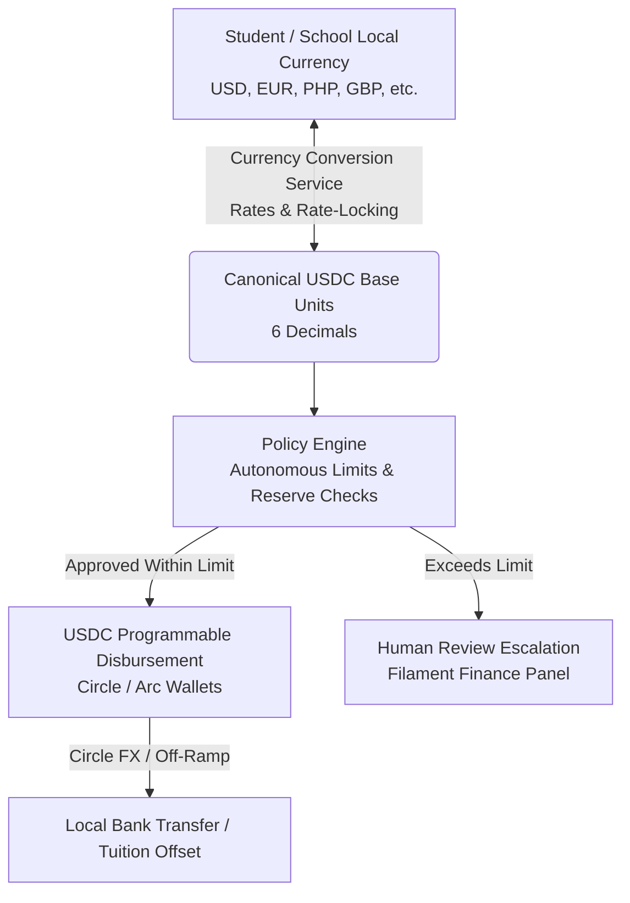

# EduFlow AI — Project Plan & Architecture Roadmap

**Tagline:** An autonomous financial agent for education with multi-currency conversion, bounded execution, and programmable USDC payments.

---

## 1. Executive Summary & Core Concept

EduFlow AI is an education finance platform that transforms slow, manual student financial assistance into a bounded, intelligent, and auditable system. 

Schools operate worldwide in diverse domestic fiat currencies (USD, EUR, PHP, GBP, CAD, AUD, SGD, INR, NGN), while transparent on-chain assistance pools, smart contract boundaries, and cross-border disbursements leverage **USDC on Circle and Arc infrastructure**.

EduFlow bridges this divide through an integrated **Multi-Currency Conversion & Settlement Engine**:
- **Tuition & Assistance Denomination:** Schools can bill tuition and students can view aid in their native fiat currency or USDC.
- **Deterministic Currency Conversion:** Exchange rates are fetched from verified feeds, snapshotted, and locked during evaluation so rate fluctuations never compromise institutional spending caps.
- **USDC Settlement:** Aid is disbursed autonomously as USDC on-chain, with automated conversion pathways (Circle FX / off-ramp rails) back into local currency for tuition settlement or student expenses.

Traditional education assistance models operate sequentially:
> Student request $\rightarrow$ Manual review $\rightarrow$ Manual approval $\rightarrow$ Slow cross-border bank transfer.

EduFlow introduces a **bounded autonomous agent loop with multi-currency awareness**:
> Student request (in Local Currency or USDC) $\rightarrow$ Deterministic FX quotation & rate lock $\rightarrow$ Policy evaluation against canonical USDC limits $\rightarrow$ Autonomous approval within strict boundaries $\rightarrow$ Human escalation for exceptions $\rightarrow$ Programmable USDC disbursement & local settlement.

### Non-Negotiable Security Principles
1. **No Direct LLM Fund Control:** The Large Language Model (LLM) **never** has direct access to private keys or direct authorization to move funds. All decisions are evaluated against deterministic PHP rules and dual-ledger database state.
2. **Fixed-Point Base-Unit Math:** All currency values are stored as integers in minor units (e.g. 6 decimal places for USDC, 2 decimal places for USD/EUR/PHP). Floating-point arithmetic is strictly prohibited for monetary calculations.
3. **Locked Exchange Rate Snapshots:** Every decision, reservation, and transaction records an immutable snapshot of the exchange rate, rate provider, and timestamp.
4. **The LLM Is a Proposer, Not an Authoriser:** Model output is advisory only. It may tighten a decision but never loosen one. Every money-moving path is gated by a deterministic predicate evaluated in PHP — see Part 3 §3.1 and §3.2.
5. **A Stored Hash Is a Claim, Not Proof:** A transaction is only reported as settled after the hash is confirmed on Arc. The EduFlow database cannot vouch for its own contents, and the ledger balance is never presented as on-chain funds.

---

## 2. Multi-Currency Architecture



### Supported Currencies & Precision Matrix

| Currency | Code | Type | Minor Unit Decimals | Multiplier ($1.00$) |
|---|---|---|---|---|
| **USD Coin (Settlement)** | `USDC` | Stablecoin | 6 | `1,000,000` |
| **US Dollar** | `USD` | Fiat | 2 | `100` |
| **Philippine Peso** | `PHP` | Fiat | 2 | `100` |
| **Euro** | `EUR` | Fiat | 2 | `100` |
| **British Pound** | `GBP` | Fiat | 2 | `100` |
| **Canadian Dollar** | `CAD` | Fiat | 2 | `100` |
| **Singapore Dollar** | `SGD` | Fiat | 2 | `100` |
| **Indian Rupee** | `INR` | Fiat | 2 | `100` |

---

## 3. Multi-Part Implementation Roadmap

```mermaid
graph TD
    P1[Part 1: Education Foundation & Request Intake<br/>COMPLETED] --> P2[Part 2: Deterministic Policy Engine & Multi-Currency Conversion<br/>COMPLETED]
    P2 --> P3[Part 3: AI Agent Layer (Laravel AI SDK)<br/>SDK INSTALLED]
    P3 --> P4[Part 4: Circle / Arc USDC Settlement & FX Rails<br/>IN PROGRESS]
    P4 --> P5[Part 5: Hackathon Demo & End-to-End Verification<br/>IN PROGRESS]

    style P1 fill:#d1fae5,stroke:#059669,stroke-width:2px
    style P2 fill:#d1fae5,stroke:#059669,stroke-width:2px
    style P3 fill:#fef3c7,stroke:#d97706,stroke-width:2px
    style P4 fill:#fef3c7,stroke:#d97706,stroke-width:2px
    style P5 fill:#fef3c7,stroke:#d97706,stroke-width:2px
```

---

### Part 1: Education Data Foundation & Request Intake (COMPLETED)
- [x] **Data Foundation:**
  - `Student` model linked to `User` with student number, program, year level, academic status, and attendance rate.
  - `AcademicTerm` model with calendar boundaries and `isActive()` evaluation.
  - `TuitionAccount` model storing integer base-unit USDC amounts (6 decimal places) with computed remaining balance.
  - `AssistanceRequest` model with UUID `submission_key` idempotency constraints and non-negative database triggers.
  - Database migration `2026_09_26_043655_create_education_tables.php`.
- [x] **Access Control:**
  - Extended `RoleEnums` with `STUDENT` and `FINANCE_OFFICER`.
  - Restricted Filament panels: `/finance` for finance officers/admins, `/admin` for super admins only.
  - Allowlisted user activity logging to prevent credential/secret leakage.
- [x] **Student Interface (React / Inertia 3):**
  - Student dashboard at `/student/dashboard` displaying tuition balance and request history.
  - Assistance request form at `/assistance/create` with decimal USDC validation (up to 1,000,000 max).
  - Assistance detail page at `/assistance/{id}` with clear status tracking.
- [x] **Staff Review Panel (Filament 5):**
  - Dedicated `FinancePanelProvider` at `/finance` with `AssistanceRequestResource`.
  - Read-only table and infolist showing exact 6-decimal USDC values, student academic standing, and tuition accounts.
- [x] **Testing & Validation:**
  - 249 passing Pest tests (1,144 assertions) across unit, feature, authorization, and lifecycle suites.
  - Clean TypeScript compilation (`npm run types:check`) and Vite asset bundling.

---

### Part 2: Deterministic Policy Engine & Multi-Currency Conversion (COMPLETED)

#### Objectives
1. **Currency Conversion & Exchange Rate Layer:**
   - `CurrencyRate` model and repository storing live and fallback exchange rates against USDC.
   - `CurrencyConverter` service converting between USDC base units and any supported fiat/crypto currency using integer scaling.
   - Exchange rate quote expiration and locking (`quote_id`, `rate`, `quoted_at`, `expires_at`).
   - Multi-currency display formatting utility for frontend and Filament panel (e.g. `$100.00 USDC ≈ ₱5,750.00 PHP` or `€92.50 EUR`).
2. **Institutional Assistance Funds & Policies:**
   - `AssistanceFund` model with reserve threshold ($5,000 USDC$) and daily budget limits ($1,000 USDC$).
   - `AssistancePolicyVersion` model with versioned rules for enrollment, GPA, attendance, and semester caps.
3. **Deterministic `EvaluateAssistancePolicy` Action:**
   - Check enrollment status (`enrolled`).
   - Check academic status (`qualified` or threshold GPA).
   - Check attendance threshold (e.g. $\ge 85\%$).
   - Check outstanding tuition balance ($> 0$).
   - Check student semester assistance cap.
   - Check fund minimum reserves and daily budget.
4. **Autonomous Limit vs. Human Review Split:**
   - Single autonomous limit: **$100.000000 USDC** (or converted local currency equivalent at locked rate).
   - Example ($150 USDC requested / ~₱8,625 PHP):
     - Automatic approved portion: **$100.000000 USDC** (~₱5,750 PHP).
     - Escalated human-review portion: **$50.000000 USDC** (~₱2,875 PHP).
     - Status: `partially_approved` with pending escalation.
5. **Agent Decisions & Dual-Currency Audit Logs:**
   - `AgentDecision` capturing exact evaluation rules, pass/fail checks, locked exchange rates, and split amounts.
6. **Filament Staff Actions:**
   - Staff review and one-click approve/reject actions for the escalated human-review portion in the Finance Panel.

#### Planned Files
- `app/Enums/CurrencyCode.php`
- `app/Models/CurrencyRate.php`
- `app/Services/CurrencyConverter.php`
- `app/Models/AssistanceFund.php`
- `app/Models/AssistancePolicyVersion.php`
- `app/Models/AgentDecision.php`
- `app/Actions/EvaluateAssistancePolicy.php`
- `app/Actions/ApproveEscalatedRequest.php`
- `app/Filament/Resources/AssistanceRequests/Actions/ApproveEscalatedAction.php`
- `tests/Feature/CurrencyConverterTest.php`
- `tests/Feature/PolicyEvaluationTest.php`

---

### Part 3: AI Agent Layer (Laravel AI SDK)

**Status: SDK installed; advisory layer and approval seam shipped and tested.**

`laravel/ai` v1.0.1 is installed. The four agents, the two tools and the advisory
boundary exist and are covered by 27 adversarial tests. **The LLM is not yet wired into
the request path** — `DecisionExplainer` and `AskEduFlow` are still the deterministic
placeholders described below, and no production code calls an agent. What shipped is the
part that must be correct before any model is allowed near a decision.

Shipped:
- `AssistanceAssessor`, `TreasuryAnalyst` — `HasStructuredOutput`, advisory only.
- `AskEduFlowAgent` — conversational, read-only, no tools.
- `SettlementOperator` — `Conversational` + `HasTools`, proposes via tool calls.
- `DisburseAssistance` — `Approvable`; `needsApproval()` **is** the policy engine, and
  `handle()` re-evaluates rather than trusting the earlier verdict.
- `RecordHardshipContext` — not approvable, writes advisory only.
- `AdvisoryEnvelope` / `AdvisorySanitizer` / `AdvisoryGate` — allowlist, fail-closed.

Two findings from reading the SDK rather than assuming it:
- An agent that pauses a tool must be `Conversational` (or be handed history via
  `withMessages`), or resuming throws `ApprovalNotResumableException`. `SettlementOperator`
  uses `RemembersConversations` for exactly this reason.
- `continue()` and `continueOrStart()` do **not** verify participant ownership. Any route
  resuming a conversation must call `ConversationStore::conversationBelongsTo()` first.

Remaining: wire `AdvisoryGate` into the assistance evaluation path, swap `AskEduFlow`'s
keyword matcher for `AskEduFlowAgent`, and connect the approval-resume endpoint.

#### 3.1 Three-Tier Authority Model

The LLM is a *proposer*, never an authoriser. Authority is split into three tiers and the
boundary between them is enforced in PHP, not in a prompt.

| Tier | Owner | Examples | Can move funds? |
| --- | --- | --- | --- |
| **Deterministic** | PHP, non-negotiable | limits, reserve math, daily caps, FX rate locking, auto-vs-escalate, vendor allowlist, signing | Only after all checks pass |
| **Advisory** | LLM, clamped by PHP | hardship category, urgency, confidence, review priority, narrative, anomaly flags | Never |
| **Prohibited** | — | approved amount, policy verdict, key material, recipient selection | Never |

**One-way ratchet:** the LLM may only *tighten* a decision. If the deterministic engine
returns `ESCALATE`, no model response can downgrade it to `AUTO_APPROVE`. Any code path
where model output could loosen a decision is a defect.

#### 3.2 The Seam: `Approvable` Tools

The SDK's `Approvable` contract maps directly onto bounded autonomy. An `Approvable` tool
pauses the run before executing, and `needsApproval(Request): Approval|bool` is evaluated
**per tool call against its arguments**. This predicate *is* the policy engine:

```php
class DisburseAssistance implements Approvable, Tool
{
    use InteractsWithApprovals;

    /**
     * The deterministic policy engine, evaluated per call.
     * Within limits -> executes autonomously. Over limit -> pauses for a human.
     */
    protected function needsApproval(Request $request): Approval|bool
    {
        $result = $this->policy->evaluateStudentAssistance(
            requestedAmount: $request['amount'],
            org: $this->org,
            wallet: $this->wallet,
        );

        return $result->isAutoApproved()
            ? false
            : Approval::required($result->reasoning);
    }
}
```

The model decides *what to propose*; `needsApproval()` decides *whether a human must sign*.
This replaces the current arrangement where the agent writes directly to
`CircleWalletService` — the transfer becomes a tool call that cannot bypass approval.

#### 3.3 Structured Output as the Contract

`HasStructuredOutput` with `schema(JsonSchema $schema)` produces schema-validated output,
removing the hand-rolled `validateSchema()` in `DecisionExplainer`. The advisory schema is
an **allowlist** — advisory fields only, never `approved_amount` or `decision`:

```php
public function schema(JsonSchema $schema): array
{
    return [
        'hardship_category' => $schema->string()->enum([
            'medical', 'academic_materials', 'tuition_shortfall', 'living_costs', 'other',
        ])->required(),
        'urgency' => $schema->string()->enum(['standard', 'high'])->required(),
        'confidence' => $schema->number()->min(0)->max(1)->required(),
        'narrative' => $schema->string()->required(),
        'anomaly_flags' => $schema->array()->items($schema->string())->required(),
    ];
}
```

Unknown keys returned by the model are dropped before the payload reaches the policy
engine, so a prompt-injected `"approved_amount": 999999` is discarded.

#### 3.4 Agents to Build

| Agent | Type | Role | Authority |
| --- | --- | --- | --- |
| `AssistanceAssessor` | `HasStructuredOutput` | Classify hardship, score urgency, flag anomalies | Advisory only |
| `TreasuryAnalyst` | `HasStructuredOutput` | Forecast narrative, explain reserve risk | Advisory only |
| `AskEduFlow` | `Conversational` + `RemembersConversations` | Student Q&A over balance, rates, policy | Read-only |
| `SettlementOperator` | `HasTools` (Approvable) | Propose disbursements as tool calls | Gated by `needsApproval()` |

All four use `Promptable`. `AskEduFlow` uses `RemembersConversations` so chat history
persists to the SDK's `agent_conversations` tables, replacing the stateless `fetch()` POST
in `resources/js/components/ask-eduflow.tsx`.

#### 3.5 Non-Negotiable Invariants

1. **No tool reaches `CircleWalletService` without passing `needsApproval()`.** Every
   money-moving tool implements `Approvable`.
2. **No model output is trusted for arithmetic.** All amounts are integer base units
   computed in PHP. The model never sees or emits an approved figure.
3. **Rate locking stays in PHP.** The model may explain a locked quote; it cannot create one.
4. **The agent must not run in the synchronous settlement path.** Advisory calls use
   `->queue()->then()->catch()` so a provider timeout degrades to the deterministic path
   rather than blocking a payment.
5. **Fail closed.** A missing, malformed, or schema-violating response is treated as
   "no advisory available" and the deterministic engine proceeds alone.
6. **Conversations are not authorisation.** The SDK's `continue()` / `continueOrStart()`
   do not verify participant ownership; the app must call
   `ConversationStore::conversationBelongsTo()` before resuming.

#### 3.6 Provider Strategy

`config/ai.php` supports OpenAI, Anthropic, Gemini, Azure, Bedrock, Groq, xAI, DeepSeek,
Mistral, Ollama, OpenRouter, and `openai-compatible`.

- **Demo without a key:** the `openai-compatible` driver can target a local Ollama or
  LM Studio endpoint, so the AI layer runs in a hackathon demo with no paid API key.
- **Production:** `ANTHROPIC_API_KEY` or `OPENAI_API_KEY` via the SDK's **Failover**
  support, so a provider outage degrades instead of failing.
- Provider selected through the `Laravel\Ai\Enums\Lab` enum rather than raw strings.

#### 3.7 Testing Strategy

`Agent::fake()` removes the network from the test suite entirely — no API key, no cost,
no flakiness:

```php
AssistanceAssessor::fake([['hardship_category' => 'medical', 'urgency' => 'high', ...]]);

// Faking a paused tool call, to assert the human-in-the-loop path
SettlementOperator::fake([
    AgentResponse::fakeWithPendingApprovals([
        new PendingApproval(id: 'call_abc', tool: 'DisburseAssistance', arguments: [...], reason: '...'),
    ]),
]);
```

Faking a structured agent without explicit responses auto-generates schema-conforming
data. Required adversarial tests:

- Model returns `approved_amount` → assert it is discarded, not applied.
- Model returns a verdict of `auto_approve` for an over-limit request → assert the
  ratchet holds and the call still escalates.
- Model returns malformed JSON → assert fail-closed and deterministic fallback.
- Model times out → assert no payment is blocked and nothing is half-written.
- Prompt-injected student statement attempting to override policy → assert inert.

#### 3.8 Planned Files

All shipped. `tests/Feature/Ai/AdversarialAgentTest.php` covers the five scenarios in
3.7 and `tests/Feature/Ai/ApprovalRatchetTest.php` covers the approval seam.

Still to build:
- `app/Http/Controllers/AskEduFlowController.php` — swap the keyword matcher for the agent
- Approval-resume endpoint, verifying `conversationBelongsTo()` first (3.5.6)

---

### Part 4: Circle / Arc USDC Settlement Layer & FX Off-Ramp Rails (IN PROGRESS)

**Status: on-chain settlement and reconciliation shipped; off-ramp rail not wired.**

Shipped:
- **Lepton Agent Wallet** via the published `yukazakiri/lepton-agent` package. No CLI
  strings in application code; gateways are injected via contracts.
- **Programmable Disbursements:** the autonomous $100 USDC portion dispatches through
  `CircleWalletService`; the $50 remainder dispatches only after a human authorises it in
  the `/finance` panel via `ApproveEscalatedAction`.
- **Settlement Provenance:** every transaction records its gateway, base units, explorer
  URL, and whether it was real or simulated. A stored hash is labelled **Unverified** until
  proven, never "On-chain" — the database cannot vouch for itself.
- **Reconciliation:** `php artisan lepton:reconcile` re-checks every stored hash against
  Arc via `eth_getTransactionByHash`, falling back to the Circle agent wallet history when
  RPC is unavailable. Verdicts are `verified` / `fabricated` / `unverifiable` / `ledger_only`.
- **Operations truth:** `php artisan lepton:doctor` reports CLIs, Circle auth, treasury
  identity, funding, chain reads, and ledger-versus-chain drift.

Outstanding:
- **Currency Off-Ramp / Tuition Settlement Rails:** `app/Services/TuitionSettlementService.php`
  exists and is unit-tested, but **has no caller in `app/`**. It must be wired into the
  settlement path so aid earmarked for tuition reduces the student's balance with exact
  integer ledger reconciliation. Until then this sub-feature is dead code.
- Real Arc Testnet funding: the ledger balance is a demo figure, not on-chain funds.
  Reconciliation must stay honest about the difference rather than presenting the ledger
  as settled.

---

### Part 5: Hackathon Demo & End-to-End Verification

- **Demo Walkthrough (3–5 Minutes):**
  1. **Student Login:** Juan logs in, seeing a tuition balance displayed in both local currency (e.g., `₱17,250 PHP`) and `300.00 USDC`.
  2. **Assistance Request:** Juan submits an emergency request for `150.00 USDC` (`₱8,625 PHP`).
  3. **Autonomous Evaluation:** Policy engine runs instantly:
     - Verifies enrollment (✓), attendance 95% (✓), academic standing (✓), outstanding balance (✓).
     - Checks autonomous limit ($100.00 USDC / ₱5,750 PHP).
  4. **The Split Decision:**
     - Agent approves `$100.00 USDC` immediately.
     - Escalates `$50.00 USDC` to human review with exact policy reasons.
  5. **Disbursement & Conversion:**
     - Simulates or executes Circle/Arc testnet payment of $100 USDC to Juan's wallet.
     - Displays live conversion quote and transaction receipt.
  6. **Admin Review:**
     - Finance officer logs into `/finance` and views Juan's escalated request with complete AI reasoning and locked exchange rate.
     - Administrator approves the remaining $50 USDC.
  7. **Audit & Explanation:**
     - EduFlow answers: *"Why didn't you send the full $150 USDC initially?"*
     - Agent explains the institutional threshold and currency conversion breakdown.

---

## 4. Technology Stack

- **Backend:** Laravel 13, PHP 8.5, SQLite (dev/test) / PostgreSQL (production), Laravel Octane
- **Frontend:** React 19, Inertia.js v3, Tailwind CSS v4, Radix UI, shadcn/ui, Lucide Icons
- **Admin & Operations:** Filament v5, Spatie Permission & Shield, Spatie Activitylog
- **AI:** `laravel/ai` (official Laravel AI SDK) — agents, structured output, tools,
  human tool approval, conversation memory. See Part 3.
- **Agent Infrastructure:** `yukazakiri/lepton-agent` — Circle Agent Stack + Arc gateway.
  Contracts for wallets, Arc RPC, and x402; `circle` and `fake` drivers.
- **Testing:** Pest 5, Pest Agent Plugin, PHPUnit, `Agent::fake()` for AI
- **Routing & Types:** Laravel Wayfinder, TypeScript 5.9
- **Web3 & Currency:** USDC, Circle Agent Wallets, Arc Testnet, Multi-Currency Fixed-Point Math
